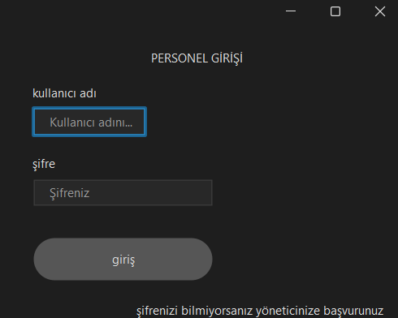
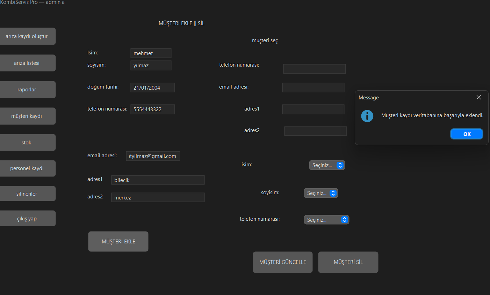
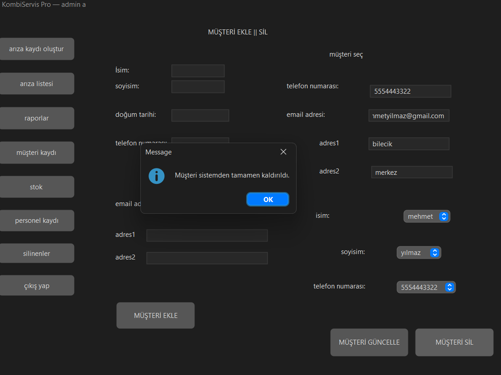
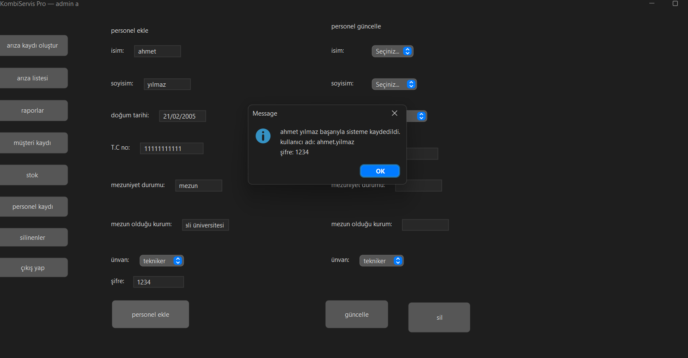
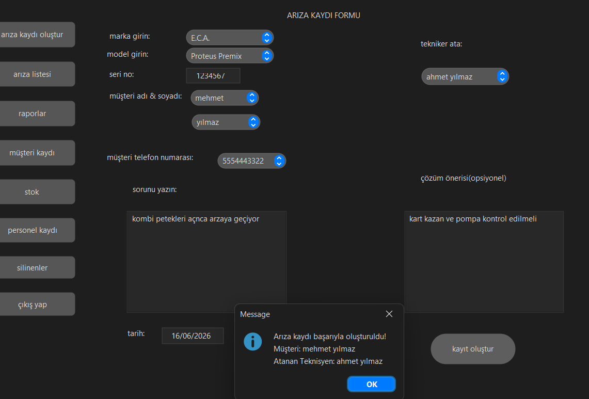
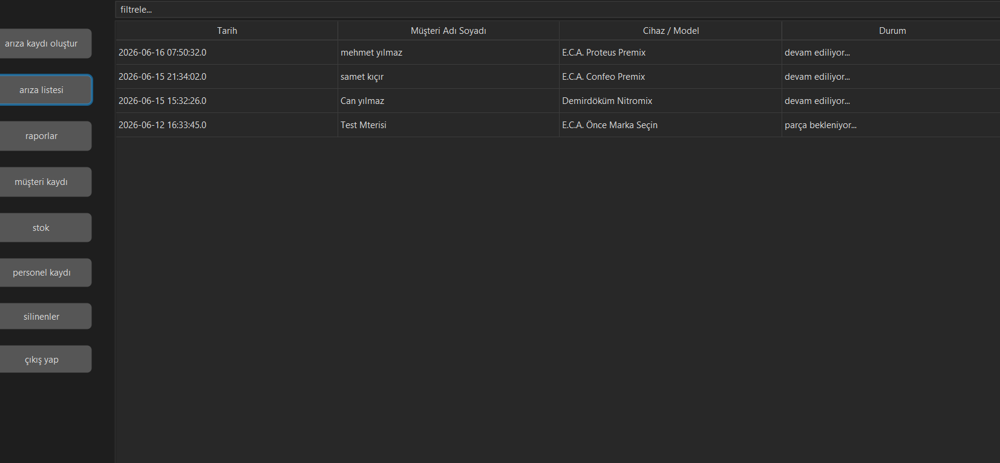
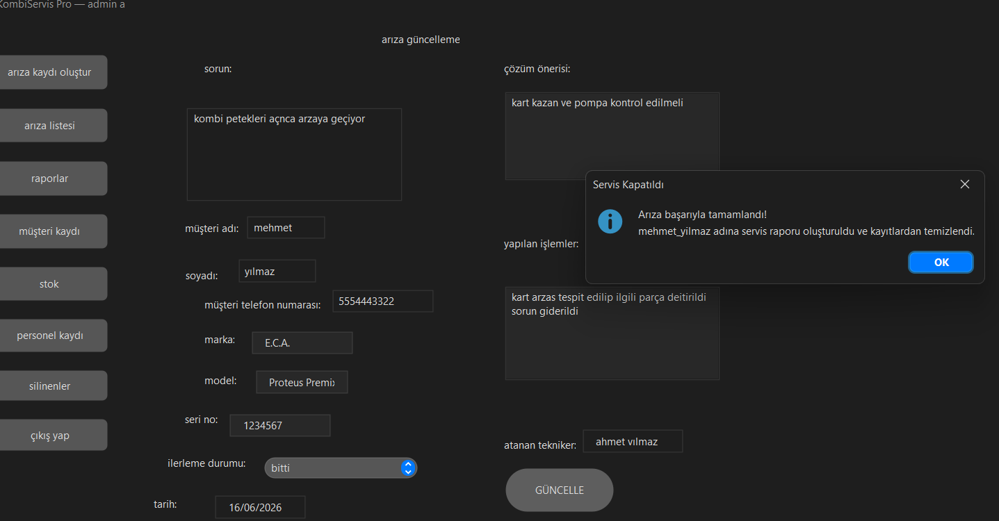
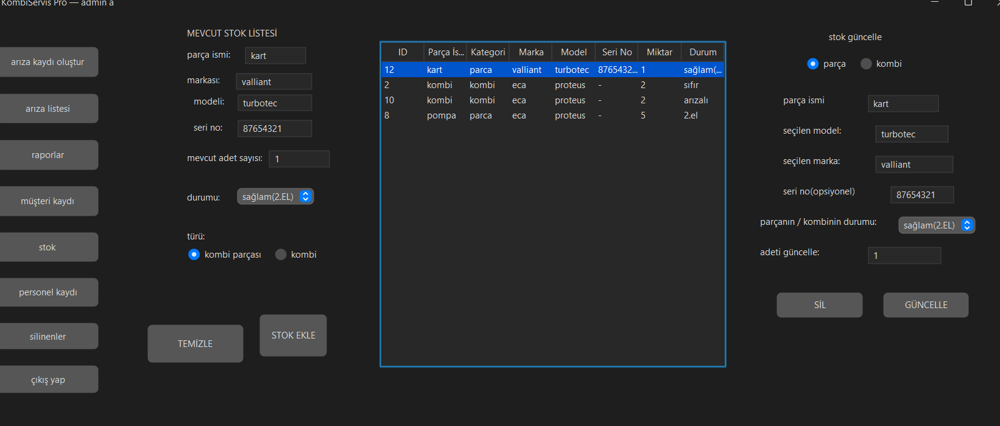
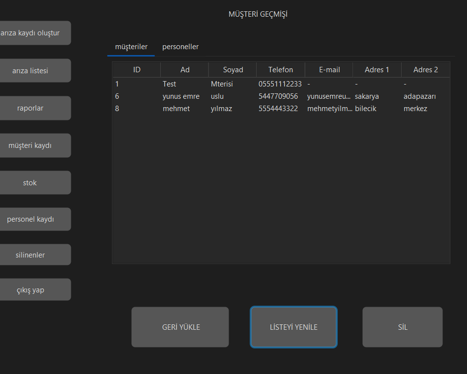
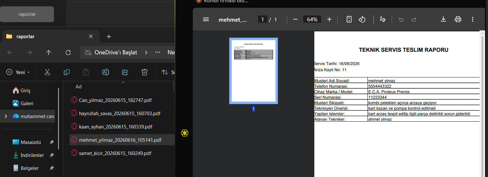

# 🔧 KombiServis Pro

KombiServis Pro, kombi teknik servis firmalarının müşteri, personel, arıza, stok ve raporlama süreçlerini dijital ortamda merkezi olarak yönetebilmesi amacıyla geliştirilmiş **Java Swing** tabanlı bir masaüstü otomasyon sistemidir.

Rol tabanlı yetkilendirme mimarisi, parametreli veri güvenliği, dinamik stok ve arıza takibi ile otomatik PDF servis raporu üretimi gibi servis operasyonlarının tüm aşamalarını kapsar.

---

## 📸 Ekran Görüntüleri

### 1. Giriş & Yetkilendirme
Personel ve admin kullanıcılar için güvenli giriş ekranı.



---

### 2. Müşteri Yönetimi
Yeni müşteri kaydı ekleme, mevcut bilgileri güncelleme ve silme işlemleri.

| Müşteri Kayıt & Düzenleme | Müşteri Silme İşlemi |
| :---: | :---: |
|  |  |

---

### 3. Personel Yönetimi
Teknisyen ve personel bilgilerinin kaydedilmesi ve otomatik kullanıcı oluşturma.



---

### 4. Arıza Takip & Yönetim
Yeni arıza formu doldurma, teknisyen atama, arıza durum takibi ve servis tamamlama süreçleri.

| Yeni Arıza Kaydı Oluşturma | Devam Eden Arızalar Listesi |
| :---: | :---: |
|  |  |

| Arıza Durum Güncelleme & Çözüm |
| :---: |
|  |

---

### 5. Stok Yönetimi
Kombi ve yedek parça stoklarının durum (sıfır/2. el/arızalı), marka, model ve seri no bazlı takibi.



---

### 6. Silinen Kayıtlar & Geri Yükleme
Silinen müşteri ve personel verilerini arşivleme ve gerektiğinde sisteme geri yükleme (Soft-delete).



---

### 7. PDF Raporlama Sistemi
Tamamlanan arıza kayıtları için iText PDF kütüphanesi ile otomatik servis teslim raporu üretimi.



---

## ✨ Özellikler

* **Kullanıcı Yönetimi**
  * Admin ve Personel rol tabanlı yetkilendirme
  * Oturum (Session) ve durum kontrolü
* **Müşteri Yönetimi**
  * Yeni müşteri ve kombi bilgileri kaydı
  * Bilgi güncelleme, arama ve geçmiş takibi
* **Arıza Yönetimi**
  * Detaylı arıza formu oluşturma ve teknisyen atama
  * Devam eden arızaların durum filtrelemesi
  * Yapılan işlemler ve çözüm önerileri kaydı
* **Stok Yönetimi**
  * Parça ve kombi bazında stok giriş/çıkışı
  * 2. El / Sıfır / Arızalı durum kontrolü
  * Marka ve model bazlı filtreleme
* **Raporlama & Çıktı**
  * Tamamlanan servisler için iText PDF destekli otomatik teknik servis teslim raporu

---

## 🛠️ Kullanılan Teknolojiler

* **Programlama Dili:** Java
* **Arayüz (GUI):** Java Swing
* **Veritabanı:** MySQL
* **Veri Erişimi:** JDBC (PreparedStatement)
* **Konteynerizasyon:** Docker (MySQL Container)
* **Raporlama Kütüphanesi:** iText PDF
* **Mimari / Tasarım:** MVC & DAO (Data Access Object) Pattern
* **Geliştirme Ortamı:** NetBeans / IntelliJ IDEA

---

## 📁 Proje Mimarisi

```text
src
│
├── DAO
│   ├── arizaDAO.java
│   ├── kullaniciDAO.java
│   ├── musteriDAO.java
│   └── stoklarDAO.java
│
├── Model
│   ├── Ariza.java
│   ├── Kullanici.java
│   ├── Musteri.java
│   ├── Stok.java
│   └── StokHareket.java
│
├── UI
│   ├── Login
│   ├── Main
│   ├── Müşteri İşlemleri
│   ├── Personel İşlemleri
│   ├── Arıza İşlemleri
│   └── Stok İşlemleri
│
├── Util
│   ├── DBconnection.java
│   └── SessionManager.java
│
└── Design
```

---

## 🗄️ Veritabanı Yapılandırması

Projede veri tabanı olarak **MySQL** kullanılmıştır. Geliştirme sürecinde Docker üzerinde izole bir container içerisinde çalıştırılmıştır.

* **Host:** `localhost`
* **Port:** `3306`
* **Database:** `mydb`

> **Not:** Uygulama standart JDBC bağlantısıyla çalışır. `Util/DBconnection.java` dosyasındaki URL, kullanıcı adı ve şifre bilgilerini yerel MySQL ortamınıza göre düzenleyebilirsiniz.

---

## 🚀 Kurulum & Çalıştırma

1. **Depoyu Klonlayın:**
   ```bash
   git clone [https://github.com/canyilmaz959/kombi-servis-otomasyonu.git](https://github.com/canyilmaz959/kombi-servis-otomasyonu.git)
   ```
2. **Veritabanını Hazırlayın:** MySQL sunucunuzda veritabanı şemasını içe aktarın.
3. **Bağlantı Ayarları:** `src/Util/DBconnection.java` dosyasındaki veritabanı kimlik bilgilerini güncelleyin.
4. **IDE ile Açın:** Projeyi NetBeans veya IntelliJ IDEA ile içe aktarın.
5. **Kütüphaneleri Ekleyin:** MySQL JDBC Driver ve iText PDF kütüphanelerinin `Classpath`'e dahil olduğundan emin olun.
6. **Çalıştırın:** Projeyi derleyip `Login` ekranı üzerinden başlatın.

---

## 🔒 Güvenlik

* **SQL Injection Koruması:** Tüm veritabanı sorgularında `PreparedStatement` kullanımı.
* **Yetki Kontrolü:** Rol bazlı menü ve ekran kısıtlamaları.
* **Oturum Yönetimi:** `SessionManager` ile aktif kullanıcı doğrulama.

---

## 📌 Yol Haritası (Geliştirilebilecek Özellikler)

* [ ] Şifrelerin BCrypt ile hashlenerek saklanması
* [ ] Detaylı sistem loglama mekanizması
* [ ] Dashboard ve grafiksel istatistik paneli
* [ ] SMS / E-posta servis bildirim entegrasyonu
* [ ] REST API desteği ile mobil uygulama bağlantısı

---

## 📄 Lisans

Bu proje eğitim ve portfolyo amacıyla geliştirilmiştir.

---

## 👨‍💻 Geliştirici

**Can Yılmaz**  
*Bilgisayar Programcılığı*  
`Java` • `Swing` • `JDBC` • `MySQL` • `Docker`
